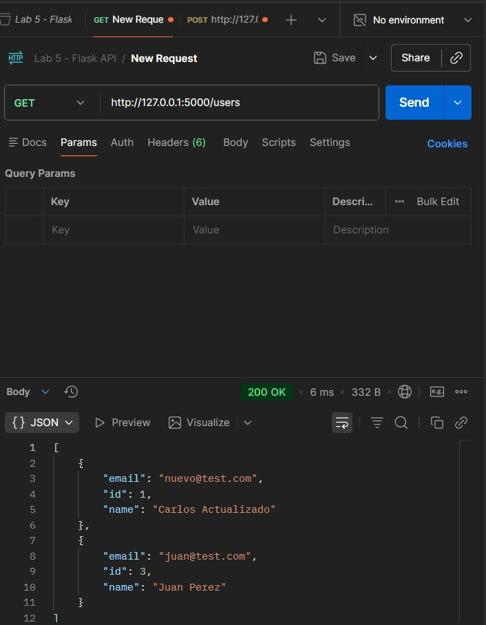
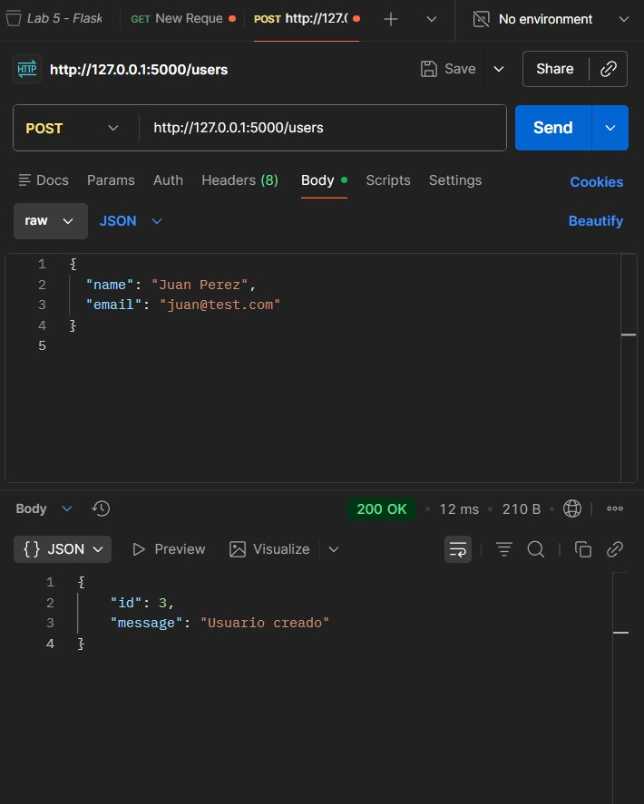
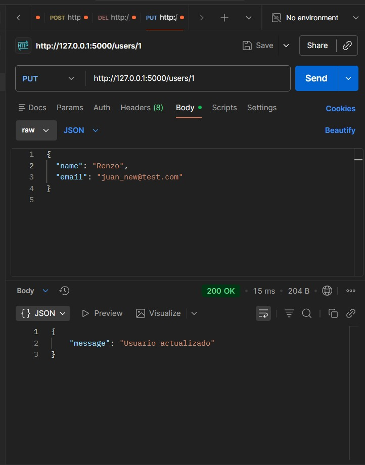
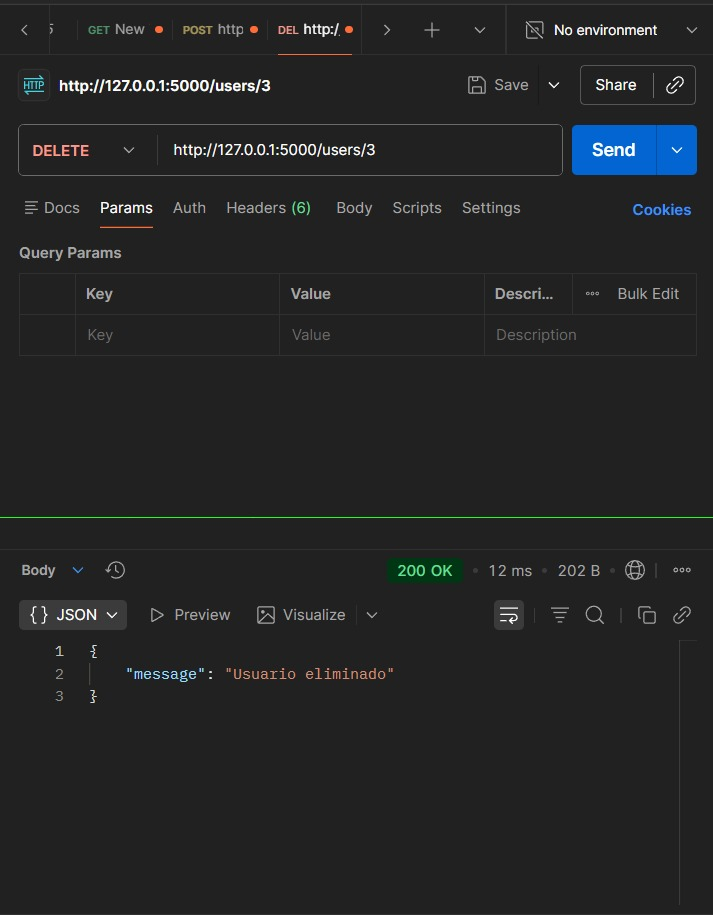
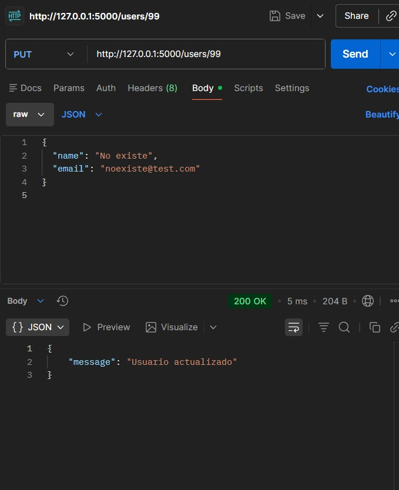

# FLASK
Laboratorio 5

Descripción general del proyecto
Este proyecto consiste en la creación de una API REST utilizando el framework Flask y la base de datos SQLite.  
La API permite realizar operaciones CRUD (Crear, Leer, Actualizar y Eliminar) sobre un recurso llamado usuarios.  

El sistema está compuesto por:
- `app.py`: servidor Flask y rutas.
- `db.py`: funciones CRUD que interactúan con SQLite.
- `init_db.py`: script para crear la base de datos.
- `structureDB.sql`: definición de la tabla `users`.
- `myDB.db`: base de datos generada.

El proyecto fue probado utilizando **Postman**, donde se verificó el funcionamiento de todos los métodos implementados.

---

Modo de funcionamiento de los 4 métodos

1. GET 
Obtiene la lista completa de usuarios almacenados en la base de datos.

- Método HTTP:GET  
- URL: `http://127.0.0.1:5000/users`  
- Retorna: un arreglo JSON con todos los usuarios.

---

2. POST 
Crea un nuevo usuario mediante un cuerpo JSON.

- Método HTTP: POST  
- URL:`http://127.0.0.1:5000/users`  
- Body (JSON):
```json
{
  "name": "Juan Perez",
  "email": "juan@test.com"
}
```
- Retorna: ID generado y mensaje “Usuario creado”.

---

3. PUT 
Actualiza los datos de un usuario existente.

- **Método HTTP:** PUT  
- URL: `http://127.0.0.1:5000/users/1`  
- Body (JSON):
```json
{
  "name": "Renzo",
  "email": "juan_new@test.com"
}
```
- Retorna: mensaje “Usuario actualizado”.

---

4. DELETE 
Elimina un usuario por su ID.

- Método HTTP: DELETE  
- URL:`http://127.0.0.1:5000/users/3`  
- Retorna:mensaje “Usuario eliminado”.

---

Pruebas usando Postman

A continuación se muestran las imágenes de las pruebas realizadas en Postman, comprobando el correcto funcionamiento de cada método.














En esta prueba, se intentó actualizar un usuario con ID 99, el cual no existe.  
La API respondió con código 200 OK, evidenciando que no se valida la existencia del registro antes de actualizarlo.  
Se registra como prueba de error según lo solicitado.

---

##  Integrantes
- Renzo Romero Castillo  
- Sullón Cabanillas Patrick  
- Maldonado Barrera Carlos  
- Quesquén Jiménez Christian  
- Valiente Flores Samuel  
